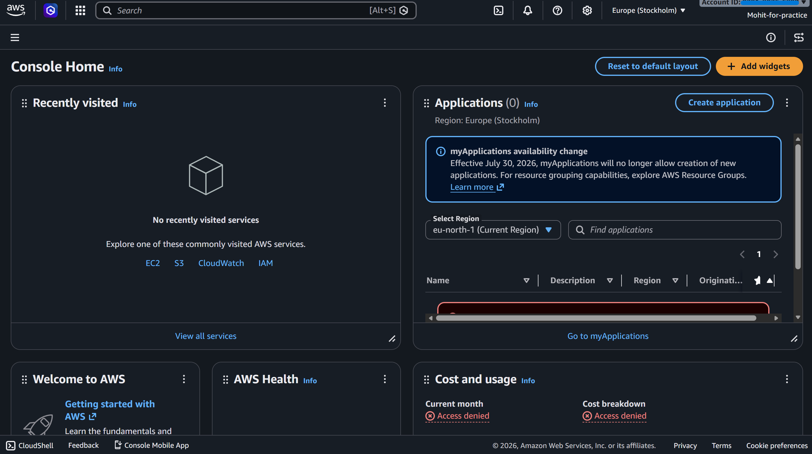
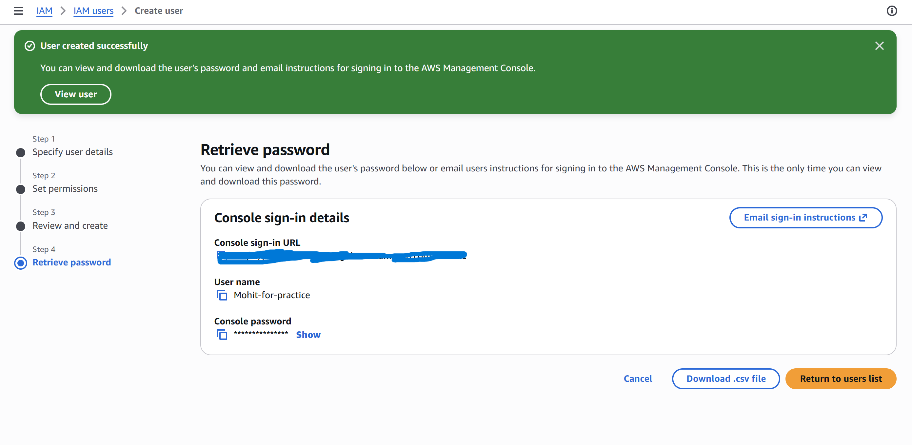
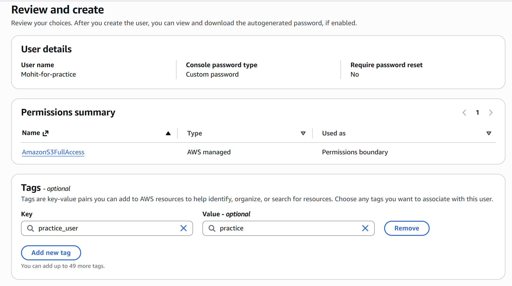
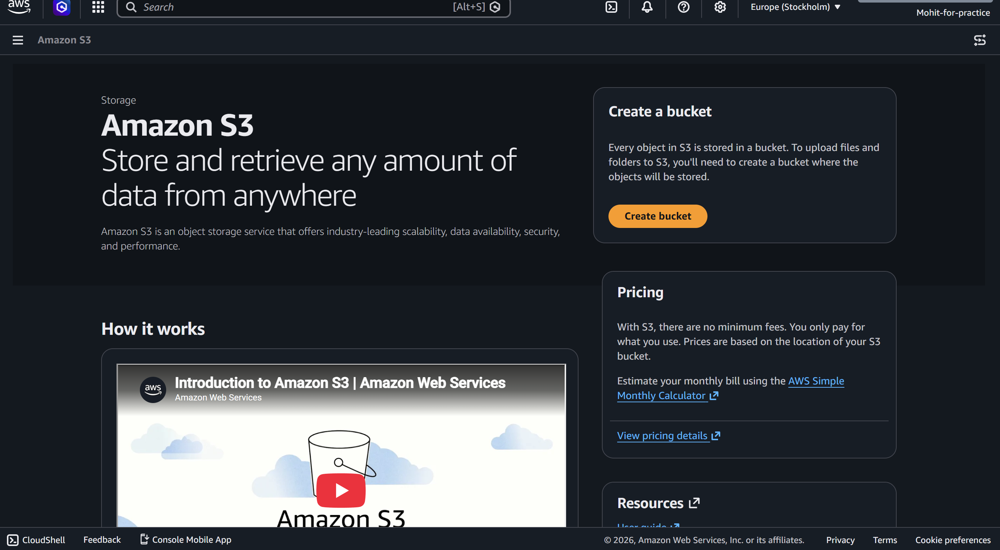

# AWS IAM - User Creation & Permission Management

> Hands-on implementation of AWS Identity and Access Management (IAM) focusing on secure user creation, permission assignment, and access management.

---

## Overview

This project demonstrates the practical implementation of AWS Identity and Access Management (IAM) by creating an IAM user with console access and assigning permissions using AWS Managed Policies.

The objective is to understand how AWS authenticates users, authorizes access to AWS resources, and enforces security through identity-based access control.

---

## Services Used

| Service | Purpose |
|---------|---------|
| AWS IAM | Identity and Access Management |

---

## Objectives

- Create an IAM User
- Configure AWS Console Access
- Set a Custom Password
- Assign Permissions using AWS Managed Policies
- Add Resource Tags
- Review User Configuration
- Verify Successful User Creation

---

## Implementation Workflow

```text
AWS Console
      │
      ▼
Open IAM Dashboard
      │
      ▼
Create IAM User
      │
      ▼
Configure Console Login
      │
      ▼
Assign Managed Policy
      │
      ▼
Add Tags
      │
      ▼
Review Configuration
      │
      ▼
Create User
```

---

## Practical Implementation

### Step 1 — Open AWS IAM Console

Navigate to the IAM Dashboard from the AWS Management Console.

---

### Step 2 — Create a New IAM User

Configure

- User Name
- Console Access
- Custom Password

---

### Step 3 — Assign Permissions

Attach an AWS Managed Policy to grant access.

Policy Used

```
AmazonS3FullAccess
```

---

### Step 4 — Add Tags

Example

| Key | Value |
|-----|-------|
| practice_user | practice |

Tags help organize and identify AWS resources.

---

### Step 5 — Review Configuration

Verify

- User Details
- Password Type
- Attached Policy
- Tags

---

### Step 6 — Create User

AWS generates

- IAM User
- Console Login URL
- Temporary Credentials

---

## Screenshots

### IAM Dashboard

> `screenshots/dashboard.png`



---

### Create User

> `screenshots/create-user.png`



---

### Permission Assignment

> `screenshots/permissions.png`



---

### Review Configuration

> `screenshots/review.png`



---

## Concepts Covered

- IAM
- Authentication
- Authorization
- IAM User
- Managed Policies
- Console Access
- Resource Tags
- Least Privilege Principle

---

## Best Practices

- Never use the Root User for daily operations.
- Enable MFA for every privileged account.
- Follow the Principle of Least Privilege.
- Prefer IAM Roles over long-term credentials.
- Use descriptive resource tags.
- Rotate credentials periodically.
- Regularly review IAM permissions.

---

## Key Takeaways

- IAM is a Global AWS Service.
- Every AWS user should have only the permissions required to perform their tasks.
- AWS Managed Policies simplify permission management.
- Tags improve resource organization.
- Console access enables secure sign-in to AWS resources.

---

## References

- AWS IAM Documentation
- AWS Security Best Practices

---

## Repository Structure

```text
IAM/
│
├── README.md
├── screenshots/
│   ├── 01-dashboard.png
│   ├── 02-create-user.png
│   ├── 03-permissions.png
│   └── 04-review.png
```

---

> **Note:** All sensitive information (Account ID, Sign-in URL, Usernames, Passwords, and any confidential identifiers) has been removed or masked before publishing the screenshots.


# Lab 2 – Advanced IAM Permission Management

## Objective

This lab focuses on implementing fine-grained access control using IAM Users, IAM Groups, AWS Managed Policies, Customer Managed Policies, and the IAM Policy Simulator.

---

## Tasks Performed

- Created multiple IAM users.
- Created IAM user groups.
- Assigned users to groups.
- Attached AWS Managed Policies.
- Created a Customer Managed Policy.
- Attached the custom policy to a developer user.
- Used IAM Policy Simulator to validate permissions.
- Verified service access using Access Advisor.
- Tested permission enforcement using Amazon S3.
- Modified the policy and observed changes in access.

---

## IAM Architecture

```
                    AWS Account
                         │
        ┌────────────────┴────────────────┐
        │                                 │
     IAM Users                      IAM Groups
        │                                 │
        ├──────────────┐                  │
        │              │                  │
 admin-user      developer-user      Developers
 auditor-user      intern-user        Admins
                                        │
                                        ▼
                                 IAM Policies
                                        │
                          ┌─────────────┴─────────────┐
                          │                           │
                 AWS Managed Policy         Customer Managed Policy
```

---

## Practical Demonstration

### IAM Users

Created four users for different organizational roles.

- admin-user
- developer-user
- intern-user
- auditor-user

---

### IAM Groups

Created user groups to simplify permission management.

- Admins
- Developers
- Interns
- Auditors

---

### Customer Managed Policy

Created a custom IAM policy named

```
CustomS3UploadPolicy
```

Permissions

✔ Upload Objects

✘ Download Objects

✘ Delete Objects

✘ EC2 Access

✘ IAM Access

---

### Policy Validation

Validated permissions using the IAM Policy Simulator.

Results

| Action | Result |
|---------|--------|
| PutObject | Allowed |
| GetObject | Denied |
| StartInstances | Denied |
| CreateUser | Denied |

---

### Access Advisor

Verified the services accessed by the developer user.

Observed

- Amazon S3
- Last Accessed Information

---

### Permission Testing

Successfully

- Created an S3 bucket
- Uploaded an object

Permission Denied

- List Buckets
- Download Objects
- Delete Objects

After updating the policy

- Verified permission changes successfully reflected.

---

## Screenshots

### IAM Users


---

### IAM Groups


---

### Customer Managed Policy


---

### IAM Policy Simulator


---

### Access Advisor


---

### Bucket Creation


---

### Upload Object


---

### List Bucket Permission Denied


---

### Delete Object Permission Denied


---

### Policy Updated


---

## Concepts Learned

- IAM Users
- IAM Groups
- AWS Managed Policies
- Customer Managed Policies
- Policy Evaluation Logic
- Least Privilege Principle
- Explicit Deny
- Implicit Deny
- IAM Policy Simulator
- Access Advisor
- Identity-based Policies

